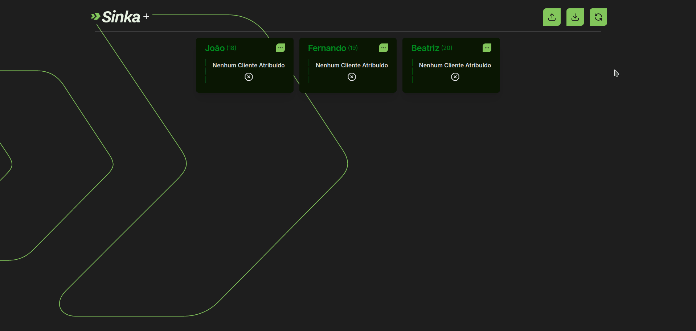
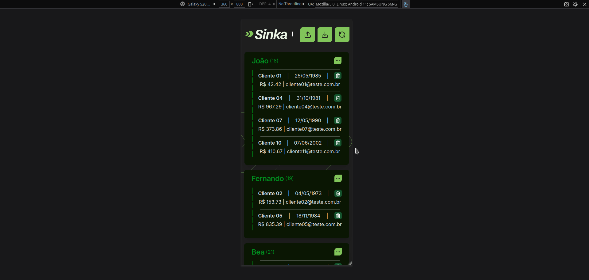
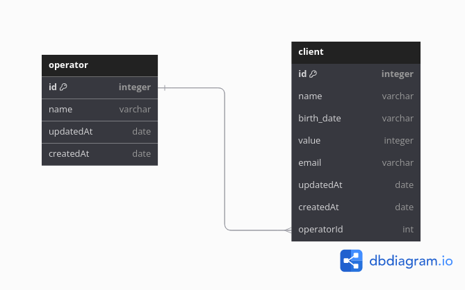

# CSV-Operator-Assignment

Este projeto consiste na solução de um desafio técnico para desenvolvedor fullstack. Dentre as funcionalides estão:

- Visualização: Permite visualizar os operadores cadastrados e os clientes designados a eles.
- Cadastro de Clientes: Oferece a funcionalidade de enviar um arquivo CSV para o cadastro imediato de clientes.
- Exportação de Clientes: Possibilita baixar um arquivo CSV com a lista de todos os clientes cadastrados.

Mais detalhes no arquivo [SinkaTest](./docs/SinkaTest.md)

## 📷 Demonstrações

### Dashboard

<div align="center">
  
</div>

### Upload de arquivo

<div align="center">
  
</div>

### Responsividade

<div align="center">
  
</div>

## 🎲 Estrutura do Banco de Dados

<p align="center">
    
</p>

## 📱 Technologias

- **TypeScript**
- **React**
- **Next.js**
- **React Query**
- **React Hook Form**
- **Zod**
- **Tailwind**
- **Componentes do ShadCN**
- **NestJS**
- **Multer**
- **CSV-parser**
- **Fast-CSV**
- **Prima**
- **Jest**
- **MySQL**

## 🌐 Variáveis Ambiente

Como a aplicação é construída usando containers docker, é necessário apenas criar as variáveis como está descrito no arquivo **env.example** na raíz do projeto.

## 🏁 Dependências

- Docker
- Docker Compose V2

## 🏗 Setup

Para construir a aplicação, você pode executar o arquivo de configuração (Linux).

Primeiramente, dê permissão ao arquivo, com o seguinte comando na raiz do projeto:

```sh
chmod +x config.sh
```

Em seguida, execute-o:

```sh
./config.sh
```

Você também pode executar os comandos descritos no arquivo manualmente, se assim preferir.

# 🏃 Run

## 📋 Endpoints

### Operators

### App

- **GET** `/` - Retorna "API on!".

- **POST** `/operators` - Cria um operador.
  - **Body:** `CreateOperatorDto`
- **GET** `/operators` - Retorna todos os operadores.

- **GET** `/operators/:id` - Retorna um operador pelo ID.

  - **Params:** `id` (number)

- **PATCH** `/operators/:id` - Atualiza um operador.

  - **Params:** `id` (number)
  - **Body:** `UpdateOperatorDto`

- **DELETE** `/operators/:id` - Remove um operador.
  - **Params:** `id` (number)

### Clients

- **POST** `/clients` - Cria um cliente.

  - **Body:** `CreateClientDto`

- **GET** `/clients` - Retorna todos os clientes.

- **GET** `/clients/download` - Exporta clientes em CSV.

- **GET** `/clients/redistribute` - Redistribui clientes entre operadores.

- **POST** `/clients/upload` - Faz upload de um CSV de clientes.

  - **Form Data:** `file` (CSV)

- **GET** `/clients/:id` - Retorna um cliente pelo ID.

  - **Params:** `id` (number)

- **PATCH** `/clients/:id` - Atualiza um cliente.

  - **Params:** `id` (number)
  - **Body:** `UpdateClientDto`

- **DELETE** `/clients/:id` - Remove um cliente.
  - **Params:** `id` (number)
